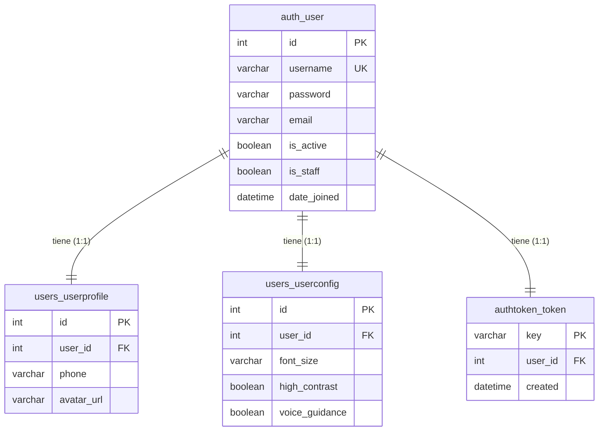

# Diccionario de Datos (Base de Datos)

Este documento detalla la estructura y relaciones de las tablas de la base de datos en el sistema de **Mentor Virtual**.

---

## 🗺️ Diagrama de Relaciones de Entidades

---

## 📋 Detalle de Tablas

### 1. Tabla: `auth_user`
Almacena la información de autenticación y datos básicos del usuario. Provisto por el modelo nativo `User` de Django.

| Campo | Tipo de Datos | Nulo | Restricciones / Valor por Defecto | Descripción |
| :--- | :--- | :---: | :---: | :--- |
| `id` | Integer | No | PK, Auto-incremental | Identificador único del usuario. |
| `username` | Varchar(150) | No | Único, Requerido | Nombre de usuario para login. |
| `password` | Varchar(128) | No | Requerido | Hash de la contraseña. |
| `email` | Varchar(254) | No | Requerido | Dirección de correo electrónico. |
| `is_active` | Boolean | No | Default: `True` | Estado de la cuenta (activo/inactivo). |
| `is_staff` | Boolean | No | Default: `False` | Indica si el usuario puede acceder al panel admin. |
| `date_joined`| DateTime | No | Auto-creado | Fecha y hora de creación de la cuenta. |
| `last_login` | DateTime | Sí | - | Fecha y hora del último inicio de sesión. |

---

### 2. Tabla: `users_userprofile` (UserProfile)
Almacena datos complementarios del perfil del usuario.

| Campo | Tipo de Datos | Nulo | Restricciones / Valor por Defecto | Descripción |
| :--- | :--- | :---: | :---: | :--- |
| `id` | Integer | No | PK, Auto-incremental | Identificador único del perfil. |
| `user_id` | Integer | No | FK (`auth_user.id`), Relación 1:1, CASCADE | Referencia al usuario correspondiente. |
| `phone` | Varchar(50) | No | Default: `""` | Número telefónico de contacto. |
| `avatar_url` | Varchar(255) | No | Default: `""` | Enlace a la imagen de avatar del usuario. |

---

### 3. Tabla: `users_userconfig` (UserConfig)
Almacena las configuraciones de accesibilidad personalizadas por el usuario.

| Campo | Tipo de Datos | Nulo | Restricciones / Valor por Defecto | Descripción |
| :--- | :--- | :---: | :---: | :--- |
| `id` | Integer | No | PK, Auto-incremental | Identificador único de la configuración. |
| `user_id` | Integer | No | FK (`auth_user.id`), Relación 1:1, CASCADE | Referencia al usuario correspondiente. |
| `font_size` | Varchar(10) | No | Default: `MEDIUM` (Opciones: `SMALL`, `MEDIUM`, `LARGE`) | Tamaño de la tipografía preferida. |
| `high_contrast`| Boolean | No | Default: `False` | Preferencia de contraste elevado para accesibilidad visual. |
| `voice_guidance`| Boolean | No | Default: `False` | Preferencia de asistencia de guiado por voz. |

---

### 4. Tabla: `authtoken_token`
Almacena los tokens activos generados para la autenticación de llamadas a la API.

| Campo | Tipo de Datos | Nulo | Restricciones / Valor por Defecto | Descripción |
| :--- | :--- | :---: | :---: | :--- |
| `key` | Varchar(40) | No | PK | Hash del token generado para autenticar. |
| `user_id` | Integer | No | FK (`auth_user.id`), Relación 1:1, CASCADE | Referencia al usuario dueño del token. |
| `created` | DateTime | No | Auto-creado | Fecha y hora en la que se generó el token. |
